# Credit_Risk_Analysis
## Overview
 We used supervised machine learning to evaluate credit risk.Credit risk is an inherently unbalanced problem, as good loans easily outnumber risky loans. Different techniques were used to train and evaluate models with unbalanced classes. Various libraries and algorithms were used to build and evaluate models using resampling.
 
 ## Purpose:
 1. Explain how a machine learning algorithm is used in data analytics.
 2. Create training and test groups from a given data set.
 3. Implement the logistic regression, decision tree, random forest, and support vector machine algorithms.
 4. Interpret the results of the logistic regression, decision tree, random forest, and support vector machine algorithms.
 5. Compare the advantages and disadvantages of each supervised learning algorithm.
 6. Determine which supervised learning algorithm is best used for a given data set or scenario.
 7. Use ensemble and resampling techniques to improve model performance.
 
 ## Results:
 The results for the six machine learning models including their respective balanced accuracy and recall scores are as follows:
 
 ## Random Oversampling
 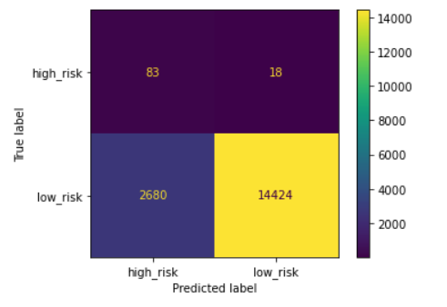
 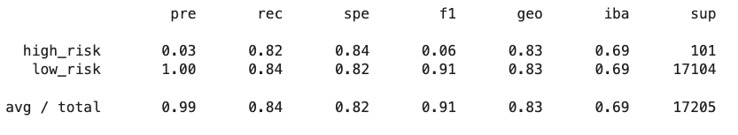
1. Balanced Accuracy: 0.8325468421491353
2. Recall: High/Low risk = .82/.87

## SMOTE Oversampling
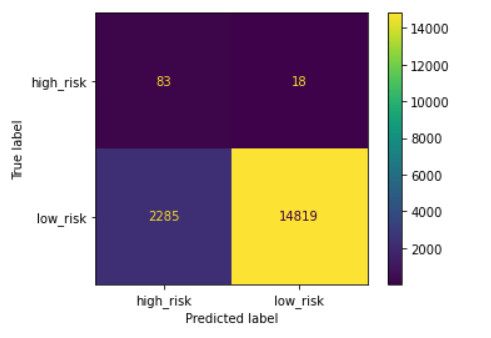
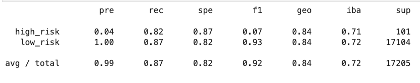

1. Balanced Accuracy: 0.8440938486973113
2. Recall: High/Low risk = .82/.87

## Undersampling
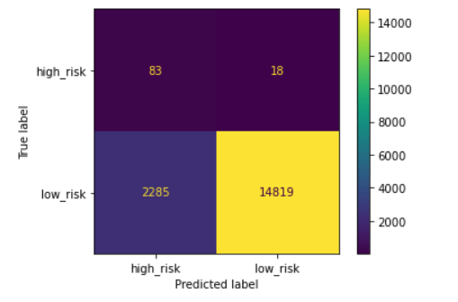
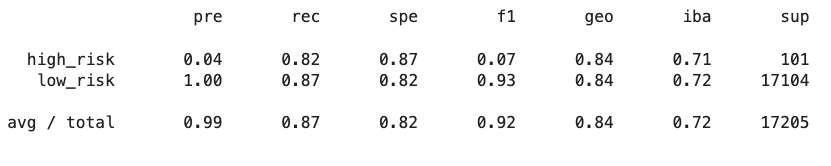

1. Balanced Accuracy: 0.8440938486973113
2. Recall: High/Low risk = .82/.87

## Combination Under-Over Sampling

1. Balanced Accuracy: 0.8440938486973113
2. Recall: High/Low risk = .82/.87

## Balanced Random Forest Classifier
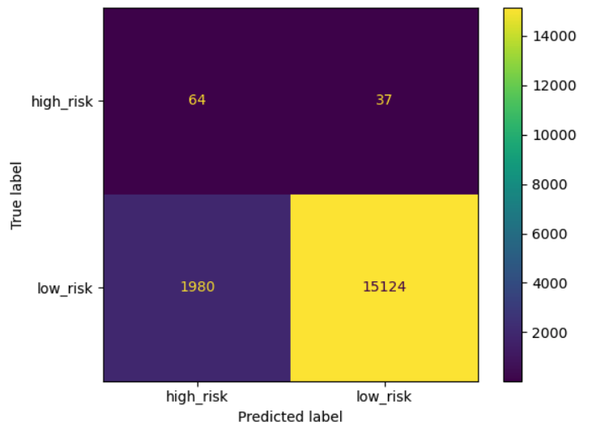
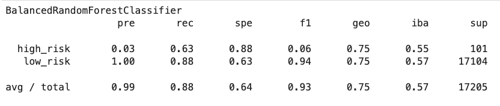

1. Balanced Accuracy: 0.759
2. Recall: High/Low risk = .63/.88

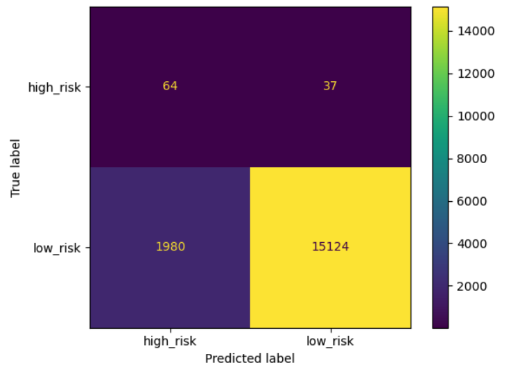
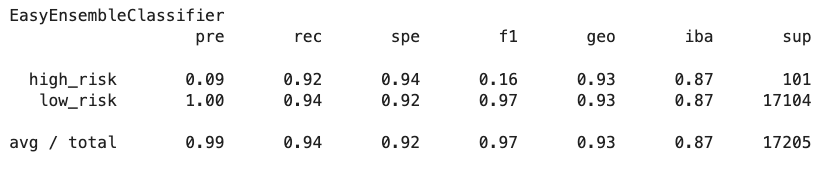

1. Balanced Accuracy: 0.759
2. Recall: High/Low risk = .63/.88

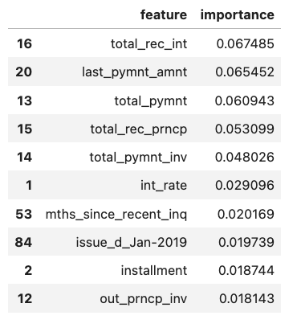

